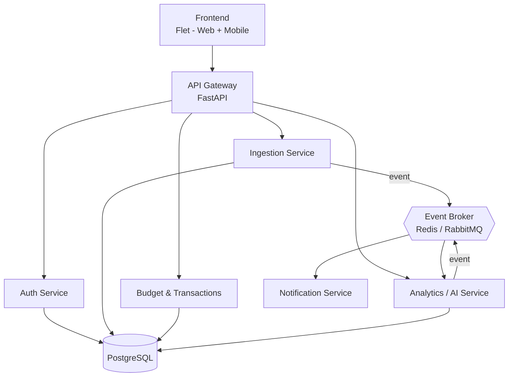

# Envelo

Self-hosted, YNAB-inspired budgeting app built as Python microservices — bank statement import, AI-powered categorization, and proactive budget alerts, fully containerized with Docker.

## About

Envelo is a personal budgeting tool based on the envelope budgeting method (the same approach used by YNAB). It was born out of a simple frustration: paid budgeting tools that don't integrate with local banks, forcing manual data entry — and a habit of checking for budget overspending *after* the money is already spent, instead of being warned *before* it happens.

Envelo is both a practical tool and a portfolio project demonstrating a Python-based microservice architecture: FastAPI services, event-driven communication, PostgreSQL, Docker, and a couple of AI-powered features that go beyond a plain CRUD app.

## Problem it solves

- No reliance on direct bank API integration — statements are exported manually and imported through the app.
- Transactions are categorized automatically instead of by hand.
- The app proactively warns when an envelope is about to exceed its limit, rather than only reporting overspending after the fact.

## Features (MVP)

- [ ] Import bank statements from a file (CSV / MT940 / OFX)
- [ ] Envelope-based budgeting with limits and categories
- [ ] Automatic transaction categorization (rules → ML)
- [ ] Proactive alerts before an envelope's limit is exceeded
- [ ] End-of-month spending forecast
- [ ] Responsive frontend (web + mobile) built with Flet

See the full roadmap and task breakdown in the project's [GitHub Issues](../../issues), organized by phase (`phase-0` through `phase-7`).

## Tech stack

| Layer | Choice | Notes |
|---|---|---|
| Backend | Python, FastAPI | microservices + API Gateway |
| Database | PostgreSQL | one schema per service |
| Event broker | Redis Streams / RabbitMQ | async communication (import → analysis → alert) |
| Frontend | Flet | web + mobile from a single Python codebase |
| Containerization | Docker + docker-compose | local-first |
| CI/CD | GitHub Actions | free tier |
| Hosting (optional, later) | Render / Fly.io + Neon/Supabase | free tier, demo only |
| Observability (stretch) | Prometheus + Grafana | local containers |

## Architecture

Envelo starts as a modular monolith and is gradually split into microservices as modules stabilize — see [`docs/architecture.md`](docs/architecture.md) for the full breakdown, service responsibilities, and data flow, and [`docs/adr/`](docs/adr) for the reasoning behind key decisions.



## Getting started (local)

```bash
git clone https://github.com/<your-username>/envelo.git
cd envelo
cp .env.example .env
docker compose up -d postgres redis
cd services/api-gateway && pip install -r requirements.txt && alembic upgrade head && cd ../..
docker compose up
```

The `alembic upgrade head` step creates the database tables — see
[`docs/migrations.md`](docs/migrations.md) for details and how to add new
migrations.

Once the containers are running, check that the API Gateway is healthy:

```bash
curl localhost:8000/health
# {"status": "ok"}
```

## Project status

Currently in **Phase 0 — local skeleton**. See the [Issues](../../issues) tab for the full roadmap, grouped by implementation phase.

## License

MIT — see [LICENSE](LICENSE).