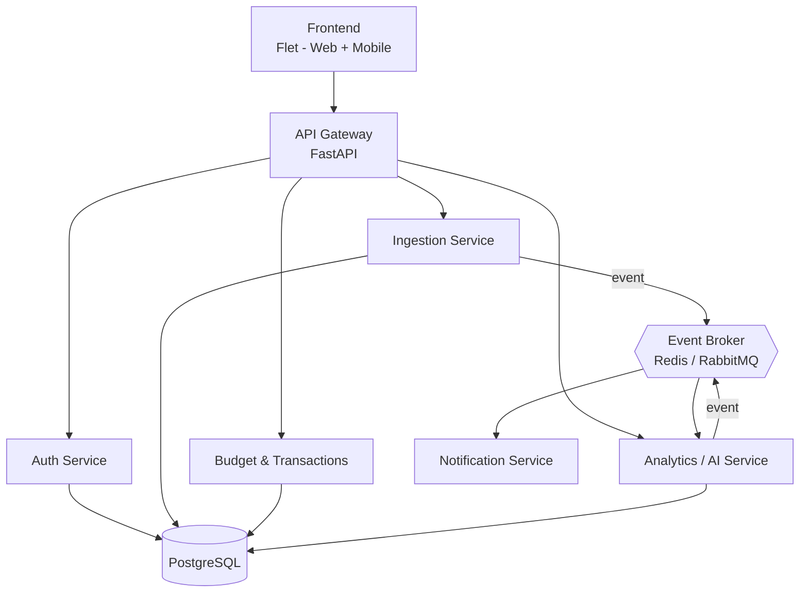

# Architecture

## Overview

Envelo starts as a **modular monolith** and is split into microservices incrementally, module by module, as each part stabilizes and its boundaries become clear. This avoids the overhead of distributed systems (network calls, eventual consistency, service discovery) before there's a real need for it, while still allowing the final result to be a genuine microservice architecture.

The first module to be split out as a standalone service is Analytics/AI, since it has different scaling and dependency requirements (ML libraries, potentially heavier compute) than the rest of the system. Auth and Ingestion follow later, once the core budgeting flow is stable.

## High-level diagram

## Services

### API Gateway
Single entry point for the frontend. Routes requests to the appropriate service, handles JWT verification (from Phase 4 onward), and aggregates responses where needed. Built with FastAPI.

### Auth Service
Owns user accounts, password hashing, and JWT issuance. Data lives in the `auth` schema. Split out from the monolith in Phase 7.

### Ingestion Service
Accepts uploaded bank statement files (CSV / MT940 / OFX), parses them into a common internal transaction format, and applies category-assignment rules. Publishes an event to the broker once import is complete. Split out from the monolith in Phase 7.

### Budget & Transactions
Core budgeting logic: envelopes, limits, categories, and the transaction ledger itself. This stays part of the modular monolith the longest, since Budget and Transactions are tightly coupled — most operations touch both.

### Analytics / AI Service
Consumes the "transaction imported" event, performs ML-based categorization (replacing the simple rules from Ingestion over time), computes end-of-month spending forecasts, and evaluates whether an envelope is approaching its limit. The first service extracted from the monolith (Phase 5).

### Notification Service
Consumes alert-worthy events (e.g. "envelope nearing limit") and delivers them via email or webhook. Deliberately kept separate from Analytics so notification channels can evolve independently of the alerting logic itself.

## Data flow: statement import (end-to-end example)

1. User uploads a bank statement file through the frontend.
2. Ingestion Service parses the file into the common transaction format and applies rule-based categorization.
3. Transactions are written to the `transactions` schema.
4. Ingestion publishes a `transaction.imported` event to the broker.
5. Analytics Service consumes the event: refines categorization with ML, recomputes the spending forecast, and checks envelope thresholds.
6. If a threshold is crossed, Analytics publishes an `envelope.threshold_exceeded` event.
7. Notification Service consumes that event and sends an alert (email/webhook) to the user — **before** the envelope's limit is fully exceeded, not after.

## Communication patterns

- **Synchronous (REST)**: frontend ↔ API Gateway ↔ services, for anything the user is actively waiting on (fetching envelopes, submitting a file, logging in).
- **Asynchronous (events via Redis Streams / RabbitMQ)**: anything that shouldn't block the user-facing request — categorization, forecasting, alerting. This keeps the import endpoint fast and decouples Ingestion from Analytics and Notifications.

## Database strategy

A single PostgreSQL instance is used, with **one schema per service** (`auth`, `budget`, `transactions`, …) rather than fully separate database instances. This gives clear data ownership and an easy migration path to fully separate databases later, without the operational overhead of managing multiple database instances from day one.

Each service's own migrations are managed independently via Alembic, scoped to its schema.

See [`docs/erd.md`](erd.md) for the entity-relationship diagram of the current schema.

## Key decisions

See [`docs/adr/`](adr) for the full reasoning behind:
- Starting with a modular monolith instead of microservices from day one
- Choice of event broker (Redis Streams vs RabbitMQ)
- Choice of Flet as the frontend framework
