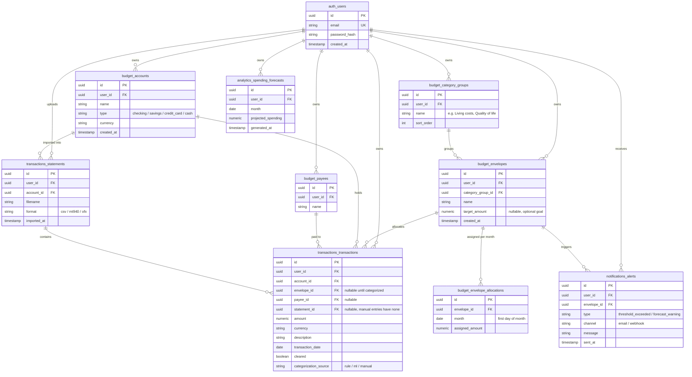

# Data model (ERD)

Two layers here:

1. **YNAB-style budgeting core** — accounts, payees, category groups, envelopes, and monthly envelope allocations (the "give every dollar a job" mechanic: money is assigned to an envelope *per month*, separately from how much has actually been spent from it).
2. **Envelo's own additions**, on top of that core, driven by the goals in [README.md](../README.md#problem-it-solves) and [architecture.md](architecture.md): bank statement import as a first-class source, an explicit `categorization_source` so rule-based and ML categorization can be told apart, proactive alerts, and end-of-month forecasts.

`auth`, `budget`, and `transactions` are the Postgres schemas that already exist (see [architecture.md § Database strategy](architecture.md#database-strategy)). `notifications` and `analytics` are **planned** schemas — they show up once the Notification Service and the Analytics/AI Service (split out in later phases, per architecture.md § Services) need to persist their own state; until then their data can live as plain tables in `budget`/`transactions`.

## Notes

**YNAB-style core**
- `budget_envelopes` is Envelo's "envelope" and doubles as YNAB's "category" — grouped by `budget_category_groups` (YNAB's category groups, e.g. "Immediate Obligations").
- `budget_envelope_allocations` is what makes this envelope budgeting rather than plain spending limits: the amount *assigned* to an envelope is tracked per month, separately from `target_amount` (an optional standing goal, e.g. "keep $500/month in Groceries") and separately from actual spend, which is derived by summing `transactions_transactions.amount` for that envelope within the month rather than stored.
- `budget_payees` mirrors YNAB's payee list (autocomplete + per-payee history); a transaction's `payee_id` is nullable since imported statement lines may not resolve to a known payee yet.
- `budget_accounts` are the bank/cash accounts a user tracks; every transaction and every imported statement belongs to one.

**Envelo's own additions**
- `transactions_statements` makes file import (CSV/MT940/OFX) a first-class object instead of a fire-and-forget upload, so a transaction can always be traced back to the file it came from — useful for debugging bad imports and for re-running categorization.
- `categorization_source` on `transactions_transactions` distinguishes rule-based (Ingestion Service) from ML-based (Analytics Service) categorization, matching the two-stage categorization described in [architecture.md § Data flow](architecture.md#data-flow-statement-import-end-to-end-example).
- `notifications_alerts` and `analytics_spending_forecasts` back the two features that go beyond a plain CRUD budgeting app: proactive over-limit warnings and end-of-month spending forecasts (see [README.md § Features](../README.md#features-mvp)). Both are grouped under schemas that don't exist yet — add them when the corresponding service is split out and needs its own storage, per the phased approach in [architecture.md § Overview](architecture.md#overview).

**Cross-schema references**
- Foreign keys that cross schema boundaries (e.g. `budget_accounts.user_id` → `auth_users.id`) are real FK constraints only while everything lives in one Postgres instance. Once a service gets its own database, these become application-level checks instead.
